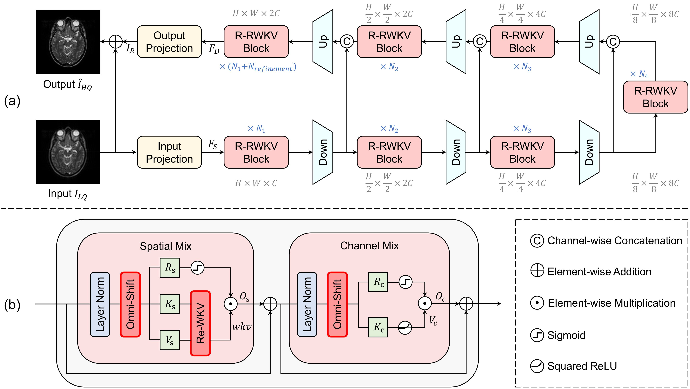
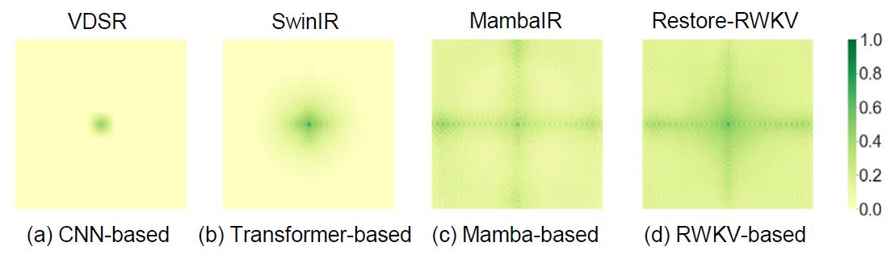
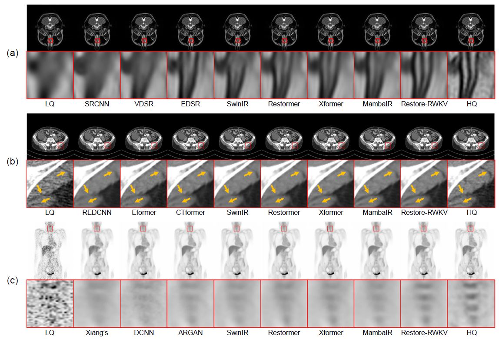

# Restore-RWKV: Efficient and Effective Medical Image Restoration with RWKV

PyTorch implementation for 《Restore-RWKV: Efficient and Effective Medical Image Restoration with RWKV》[](https://arxiv.org/abs/2407.11087)

**!!!** Check our paper collection of recent [Awesome-RWKV-in-Vision](https://github.com/Yaziwel/Awesome-RWKV-in-Vision)

## Network Architecture



## Effective Receptive Field



## Visualization



## Dataset

You can download the preprocessed datasets for MRI image super-resolution, CT image denoising, and PET image synthesis from Baidu Netdisk [here](https://pan.baidu.com/s/1oBBG_Stcn7cfO8U49S146w?pwd=3x13 ).

The original dataset for MRI super-resolution and CT denoising are as follows:

- MRI super-resolution: [IXI dataset](http://brain-development.org/ixi-dataset/)

- CT denoising: [AAPM dataset](https://www.aapm.org/grandchallenge/lowdosect/)

## TODO

- [ ] Restore-RWKV based on RWKV6
- [x] Release the arXiv version paper
- [x] Restore-RWKV based on RWKV4

## Citation

If you find Restore-RWKV useful in your research, please consider citing:

```bibtex
@misc{yang2024restorerwkv,
      title={Restore-RWKV: Efficient and Effective Medical Image Restoration with RWKV}, 
      author={Zhiwen Yang and Hui Zhang and Dan Zhao and Bingzheng Wei and Yan Xu},
      year={2024},
      eprint={2407.11087},
      archivePrefix={arXiv},
      primaryClass={eess.IV}
}
```

